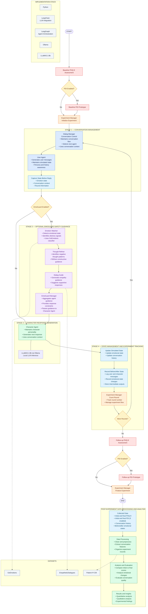

```mermaid
flowchart TD
    START(["START"]) --> PHQ0["Baseline PHQ-9 Assessment"]
    PHQ0 --> PDIQ{"PDI Enabled?"}

    PDIQ -->|Yes| PDI0["Baseline PDI Prototype"]
    PDIQ -->|No| INIT["Experiment Manager<br/>Initialize Experiment"]
    PDI0 --> INIT

    INIT --> DM

    subgraph CONV["STAGE 1 — CONVERSATION MANAGEMENT"]
        direction TB

        DM["Dialog Manager<br/>Conversation Control<br/>• Maintains conversation flow<br/>• Selects next agent<br/>• Uses conversation context"]

        UA["User Agent<br/>• Generates user messages<br/>• Maintains simulated state<br/>• Persona and history awareness"]

        SNAP["Capture State Before Reply<br/>• Emotion state<br/>• Conversation context<br/>• Round information"]

        DM --> UA
        UA --> SNAP
    end

    SNAP --> EG{"EmoGuard Enabled?"}

    subgraph GUARD["STAGE 2 — OPTIONAL EMOGUARD SAFETY GUIDANCE"]
        direction TB

        EW["Emotion Watcher<br/>• Detects emotional state<br/>• Identifies distress signals<br/>• Uses GoEmotions classifier"]

        TR["Thought Refiner<br/>• Identifies negative thought patterns<br/>• Refines constructive guidance"]

        DG["Dialog Guide<br/>• Generates empathy guidance<br/>• Suggests supportive responses"]

        EM["EmoGuard Manager<br/>• Aggregates agent guidance<br/>• Provides response constraints<br/>• Passes guidance to Character Agent"]

        EW --> TR --> DG --> EM
    end

    EG -->|Yes| EW
    EG -->|No| CA

    EM --> CA

    subgraph RESPONSE["STAGE 3 — CHARACTER RESPONSE GENERATION"]
        direction TB

        CA["Character Agent<br/>• Maintains character personality<br/>• Generates next response<br/>• Uses conversation context"]

        LLM["LLaMA3.1:8b via Ollama<br/>Local LLM Inference"]

        CA --- LLM
    end

    CA --> US

    subgraph TRACKING["STAGE 4 — STATE MANAGEMENT AND EXPERIMENT TRACKING"]
        direction TB

        US["Update Simulated State<br/>• Update emotional state<br/>• Update conversation history"]

        LOG["Record Before/After State<br/>• Log user and character messages<br/>• Record emotional state changes<br/>• Store intermediate outputs"]

        MT["Experiment Manager<br/>Count Round<br/>• Track round number<br/>• Manage experiment flow"]

        MORE{"More Rounds?"}

        US --> LOG --> MT --> MORE
    end

    MORE -->|Yes| DM
    MORE -->|No| PHQ1["Follow-up PHQ-9 Assessment"]

    PHQ1 --> PDIQ2{"PDI Enabled?"}
    PDIQ2 -->|Yes| PDI1["Follow-up PDI Prototype"]
    PDIQ2 -->|No| FINAL["Experiment Manager<br/>Finalize Experiment"]
    PDI1 --> FINAL

    FINAL --> END(["END"])

    subgraph EVALUATION["POST-EXPERIMENT DATA PROCESSING AND ANALYSIS"]
        direction TB

        DATA["Collected Data<br/>• Initial and final PHQ-9<br/>• Initial and final PDI (if enabled)<br/>• Conversation history<br/>• Before/after emotional states"]

        PROCESS["Data Processing<br/>• Clean and preprocess<br/>• Extract conversation features<br/>• Organize experiment records"]

        ANALYSIS["Analysis and Evaluation<br/>• Compare initial vs final scores<br/>• Analyze emotional changes<br/>• Evaluate conversation quality"]

        RESULT["Results and Insights<br/>• Quantitative analysis<br/>• Qualitative analysis<br/>• Experimental findings"]

        DATA --> PROCESS --> ANALYSIS --> RESULT
    end

    END -.-> DATA

    subgraph TECH["IMPLEMENTATION STACK"]
        direction LR
        PY["Python"]
        LC["LangChain<br/>LLM Integration"]
        LG["LangGraph<br/>Agent Orchestration"]
        OL["Ollama"]
        MODEL["LLaMA3.1:8b"]
    end

    subgraph DATASETS["DATASETS"]
        direction LR
        GEO["GoEmotions"]
        EMP["EmpatheticDialogues"]
        PAT["Patient-Ψ-CM"]
    end

    EW -.-> GEO
    DG -.-> EMP
    PROCESS -.-> PAT

    classDef input fill:#dbeafe,stroke:#2563eb,color:#172554
    classDef agent fill:#dcfce7,stroke:#16a34a,color:#14532d
    classDef guard fill:#f3e8ff,stroke:#9333ea,color:#581c87
    classDef manager fill:#ffedd5,stroke:#ea580c,color:#7c2d12
    classDef decision fill:#fef3c7,stroke:#d97706,color:#78350f
    classDef assessment fill:#fee2e2,stroke:#dc2626,color:#7f1d1d
    classDef storage fill:#e0f2fe,stroke:#0284c7,color:#0c4a6e
    classDef result fill:#dcfce7,stroke:#15803d,color:#14532d
    classDef tech fill:#f1f5f9,stroke:#64748b,color:#1e293b

    class UA,DM input
    class CA agent
    class EW,TR,DG,EM guard
    class INIT,MT,FINAL manager
    class EG,PDIQ,PDIQ2,MORE decision
    class PHQ0,PHQ1,PDI0,PDI1 assessment
    class SNAP,US,LOG,DATA storage
    class PROCESS,ANALYSIS,RESULT result
    class PY,LC,LG,OL,MODEL,GEO,EMP,PAT tech
```